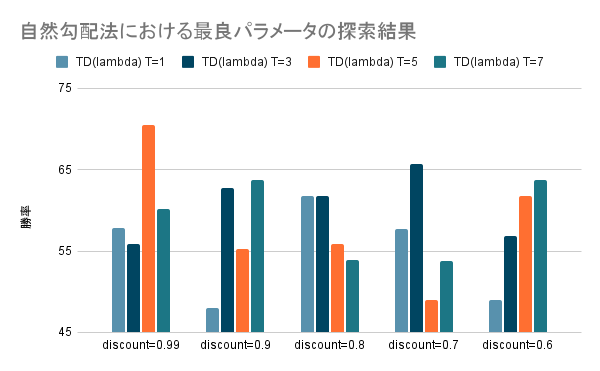

# ERHEA_2021

こちらは, FTGAIC 2021 において 4 位であった ERHEA_PPO_PG のチームのうち, 対戦相手の行動をモデリングする部分の改良を行ったものです.

## ベースコード

本 AI を実装するに当たって, FTGAIC2021 において 4 位であった ERHEA_PPO_PG のチームのソースコードを利用しています。そちらのコードは[こちら](https://www.ice.ci.ritsumei.ac.jp/~ftgaic/index-R.html)にて配布されています.

## 改良点について

本 AI は以下の 2 点の改良を実施しています.

- 時間的差分学習アルゴリズムの改良
- 強化学習アルゴリズムの改良

### 時間的差分学習アルゴリズムの改良

ERHEA_PPO_PG のチームでは, 1 step TD 法が時間的差分学習アルゴリズムとして採用されていましたが, 本 AI では TD(λ)法を採用しています.

TD(λ)法の適応をやめ 1 step TD 法に変更する場合は,
`DL/DeepModel.java`の 123 行目を`discount=0.99f`に,
131 行目を`lambda=0.6f`に変更してください.

### 強化学習アルゴリズムの改良

ERHEA_PPO_PG のチームでは, 方策勾配法が強化学習アルゴリズムとして採用されていましたが, 本 AI では自然勾配法を採用しています.

自然勾配法の適応をやめ方策勾配法に変更する場合は,
`DL/PILoss.java`の 98 行目を`if (false) {`に変更してください.

## 性能

本 AI では, 以下の 2 点の実験を行ってデータ収集を行いました.

- ハイパーパラメータの探索
- ERHEA_PPO_PG との性能比較

### ハイパーパラメータの探索

改良点で挙げた新しいアルゴリズムにはハイパーパラメータが存在します. なので最適パラメータを探索することによって性能向上が出来るかどうかという実験を行いました.各ハイパーパラメータ毎に 100 試合実施し, 勝率を計算して比較を行います.TD(λ)法の最適パラメータの実験結果のデータは`data/exp1.csv`に置いています.自然勾配法の最適パラメータの実験結果のデータは`data/exp2.csv`に置いています.

`data/exp1.csv`の情報を plot したグラフは以下の通りです.

`data/exp2.csv`の情報を plot したグラフは以下の通りです.

### ERHEA_PPO_PG との性能比較

改良点で挙げたアルゴリズムを適用した場合とそうでない場合での性能の検証を実施しました.
各手法毎に 3000 試合実施し, 勝率の中央値及び標準偏差を計算して比較を行います.実験結果のデータは`data/exp3.csv`に置いています.

`data/exp3.csv`の情報を plog したグラフは以下の通りです.

## 実験コード

上記実験を行うにあたって実装した実験用コードは[こちら](https://github.com/ruritoBlogger/FTGrunner)にて, 環境構築にて利用したコードは[こちら](https://github.com/ruritoBlogger/era_build_pack)にて公開しています.
